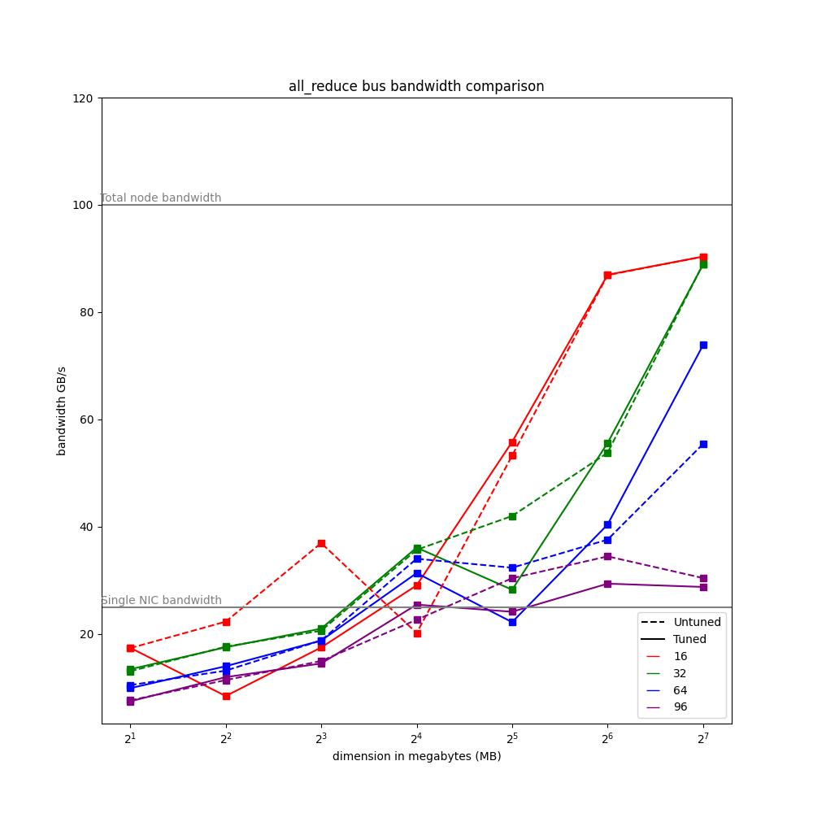

# Tuning RCCL collectives

## RCCL collectives

By default, whenever RCCL collectives are used, RCCL automatically decides, based on the topology of the network, the message size, number of nodes, etc... the best algorithm (Ring or Tree), protocol (LL, Simple or LL128) and number of channels (number of GPU CU when the kernel is launched)

## Benchamarking & Tuning

We empirically verified that benchmarking and fine-tuning collective parameters leads to a substantial increase in performance. For our experiments, we built a [Custom Dockerfile](./containerfiles/build-rocm711.docker), which builds libfabric from scratch. Remember to disable CXI and NCCL hooks so that no conflicts arise, like this [example toml](./containerfiles/rccl.toml).

To conduct our benchmarks, we measured the performance of all_reduce, allgather, reduce_scatter using [rccl-tests](https://github.com/ROCm/rccl-tests), which provides a standardized and reproducible benchmarking suite

## How to tune

This script [here](comm_tune.py) runs a grid search using rccl-tests and trying different combinations of channels/protocols/algorithms and saves the result for each combination as a .csv file.

To run with sbatch, simply use this SLURM script [here](tuning_dist.sh). Remember to change the paths.

